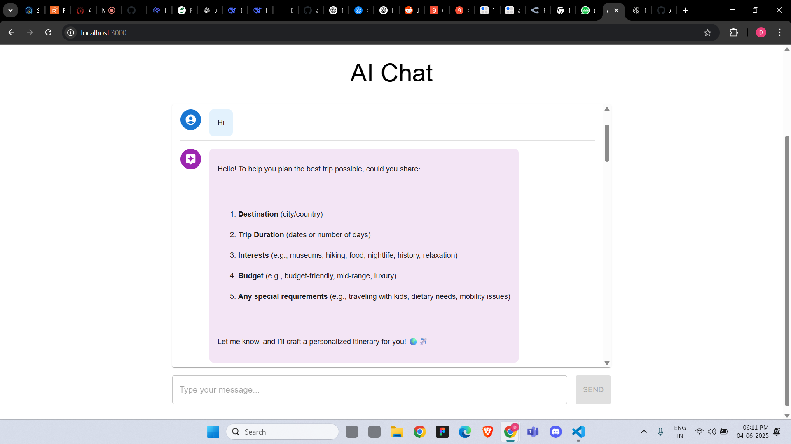
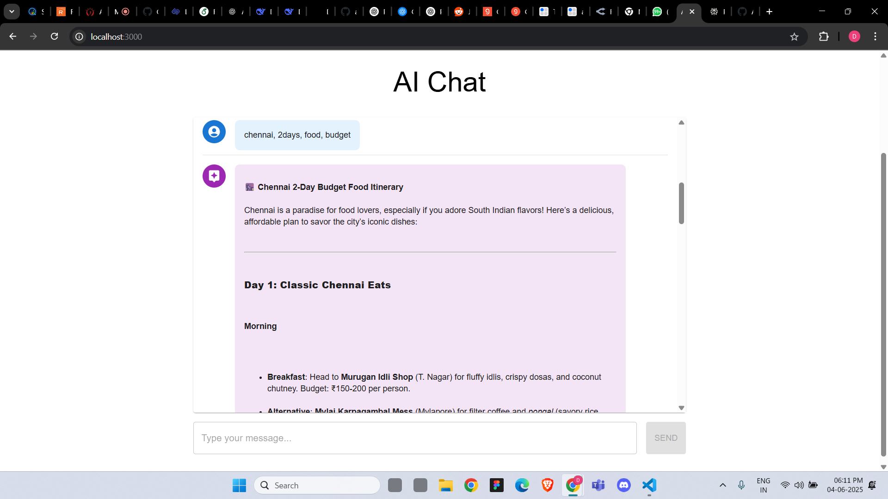

# Serverless Generative AI Chatbot

This project is a serverless Generative AI application built with a modern full-stack architecture using AWS, FastAPI, OpenAI, and a sleek Next.js frontend. It demonstrates how to build a travel-agent-style chatbot that can return markdown-formatted trip itineraries. By Sanjay Kumar R

---

## Features

- AI personas loaded from prompt files
- Markdown rendering in chat
- Elegant, minimal UI inspired by ChatGPT
- Local-first development (no deployment required)
- Modular backend logic using FastAPI and LangChain
- OpenAI-powered prompt engineering

---

## Technologies Used

### Frontend
- **Next.js** – React-based framework for frontend
- **Material UI (MUI)** – Component library for styling
- **Axios** – For HTTP calls to fetch prompts and chat responses
- **Markdown rendering** – For elegant display of AI replies

### Backend
- **FastAPI** – Python-based backend API
- **LangChain** – For advanced prompt and chain management
- **OpenAI API** – To power the LLM responses
- **SAM / AWS Lambda** – Optional support for running backend serverlessly

---

## Description

The chatbot interface allows users to select a predefined AI prompt (e.g., a Travel Agent) and engage in a conversation. When enough context is gathered, the AI generates a markdown-formatted travel itinerary that renders beautifully in the chat window.

---

## Demo

Below are screenshots of the working application:

### Chat Interface

### Markdown Itinerary Output

---

> This project is currently intended for local use only and is still evolving. Future updates will include database integration, file upload with RAG capabilities, and support for creating and storing custom prompts.